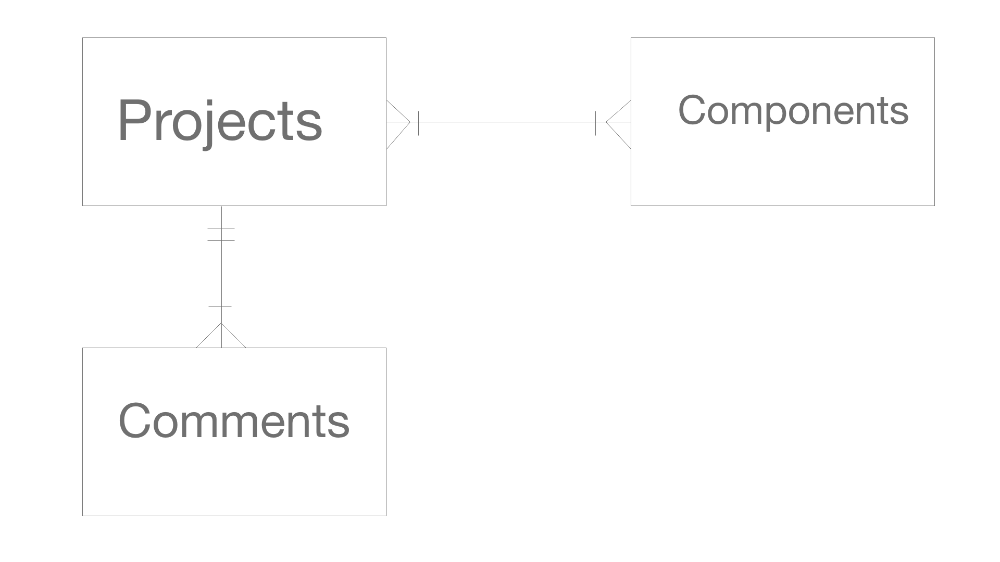
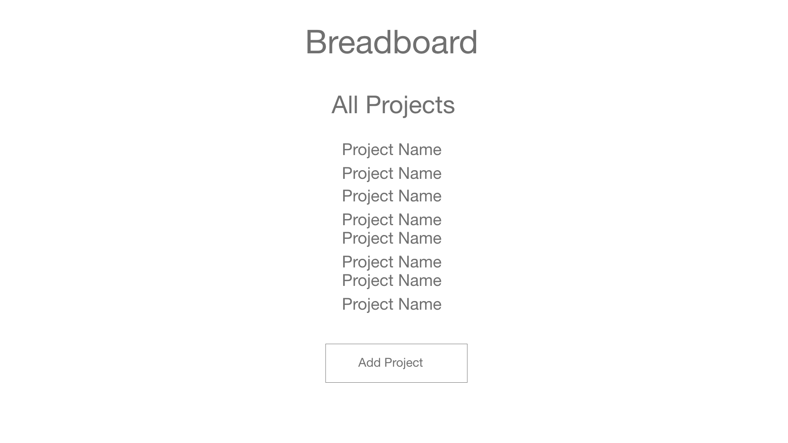
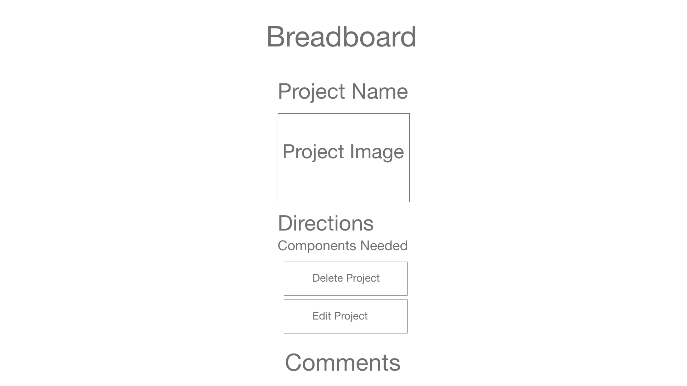
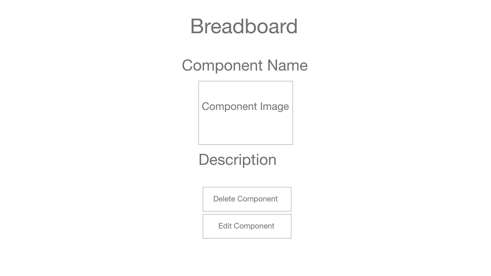
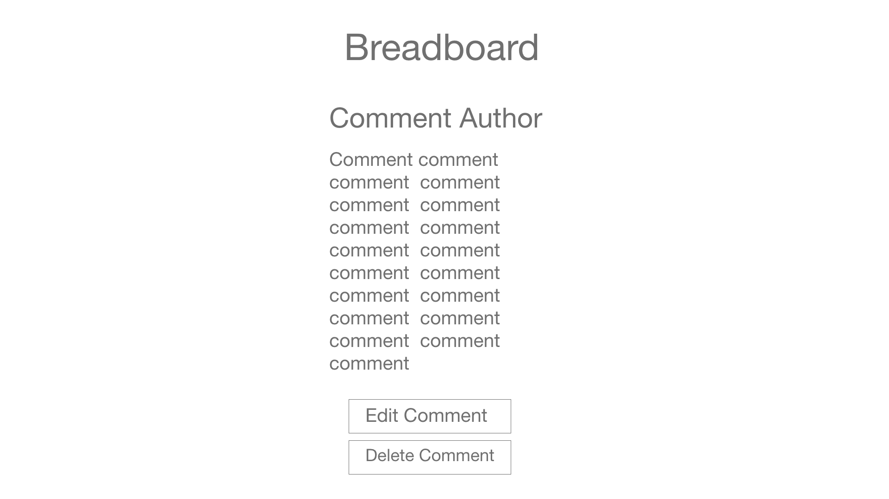
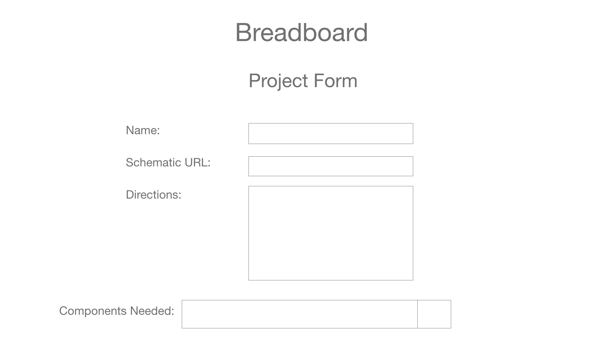
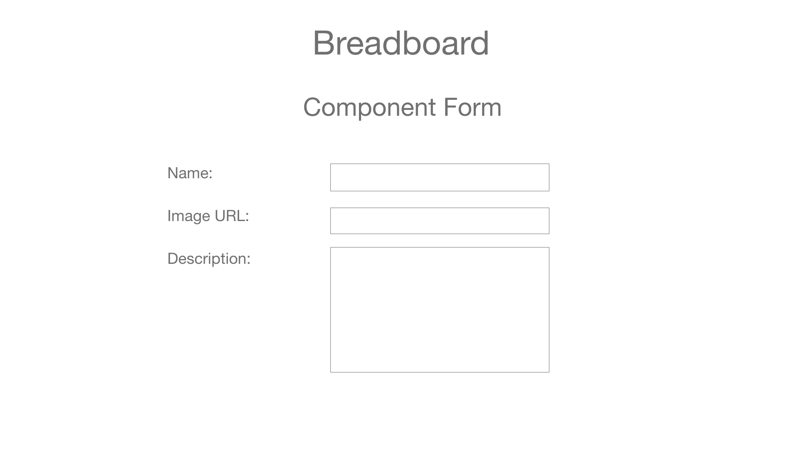
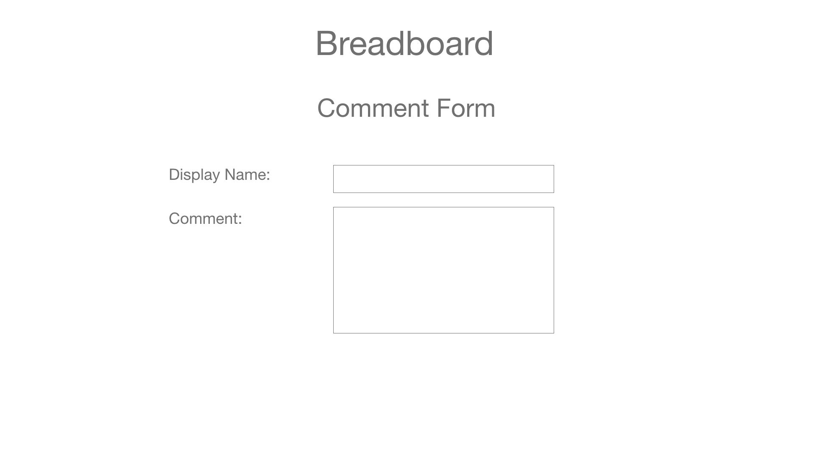

# Breadboard

[Trello Board](https://trello.com/b/vFlOvhfa/breadboard)

[Deployed App](https://breadboard-sei22.herokuapp.com/projects/34/)

## Summary

Breadboard is a platform for electrical engineers to post their projects for others to read and create. It features a many-to-many relationship between projects and components as well as a comment section for each project.

## Technologies Used

-   Python
-   Django
-   React
-   PostgreSQL
-   Rebass

## In Future Versions

In future versions I plan to implement authentication to restrict edit and delete capabilities for users who did not create a post. I also plan to add a field to my models that would allow the database to save the amount of each component needed to complete a project.

## Wireframe and ERD Images

